# 19-奇安信

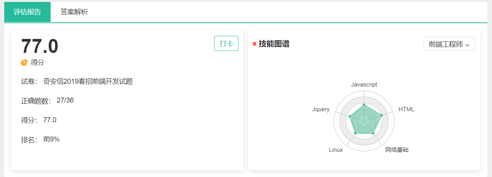

# 选择题

## HTML

* HTML 标签对大小写不敏感（在浏览器查看均以小写展示，通过属性名取值不区分大小写，均可取到。）

* <!DOCTYPE>声明有助于浏览器中正确显示网页。

  网络上有很多不同的文件，如果能够正确声明HTML的版本，浏览器就能正确显示网页内容。

  `<!DOCTYPE html> `告诉浏览器当前页面使用h5版本解析

* HTML5标签：

  * header footer √
  * center frame ×（HTML5中不支持）

* HTML5中可以使用data-* 自定义属性

* **块元素可以嵌套块元素**（不是所有块级都可以嵌套块级），有几个特殊的块**级元素只能包含内嵌元素，不能再包含块级元素**，这几个特殊的标签是：**h1~h6、p、dt。** 所以p标签中不能嵌套table，div等

* a标签可以包括任何元素，除了自身

* **HTML5表单的新增输入类型**有：email,url,number,range,Date pickers(date,month,week,time,datatime,datetime-local),color

* **无障碍性（Accessibilty）**

  * role属性作用是告诉Accessibility类应用（比如屏幕朗读程序，为盲人提供的访问网络的便利程序），这个元素所扮演的角色，主要是供残疾人使用。使用role可以增强文本的可读性和语义化。
  * tabindex 属性规定元素的 tab 键控制次序（当 tab 键用于导航时）。

* **form 元素的enctype属性**

  1. enctype属性在get请求中会被忽略，在post请求中才有效
  2. application/x-www-form-urlencoded表示会对特殊字符进行转义
  3. text/plain 以文本的形式进行编码，不会对特殊字符进行编码`
  4. multipart/form-data向服务器发送二进制文件的时候有用，例如提交文件！！！

* **HTML5 Camvas性能优化**

  1. 讲渲染阶段的开销转嫁到计算阶段之上

  2. 使用多个分层的Canvas绘制复杂场景

  3. 不要频繁设置绘图上下文的 font 属性。

  4. 不在动画中使用 putImageData 方法。

  5. 通过计算和判断，避免无谓的绘制操作

  6. 将固定的内容预先绘制在离屏 Canvas 上以提高性能。

  7. 使用 Worker 和拆分任务的方法避免复杂算法阻塞动画运行。

     https://blog.csdn.net/weixin_33940102/article/details/90687163?depth_1-utm_source=distribute.pc_relevant.none-task&utm_source=distribute.pc_relevant.none-task

     https://developer.mozilla.org/zh-CN/docs/Web/API/Canvas_API/Tutorial/Optimizing_canvas

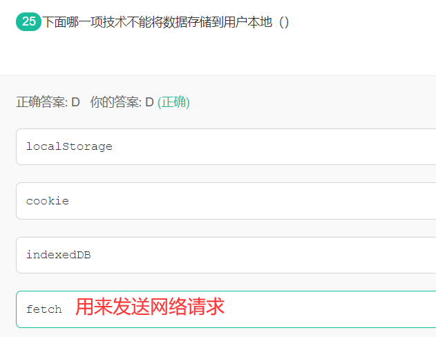

# CSS

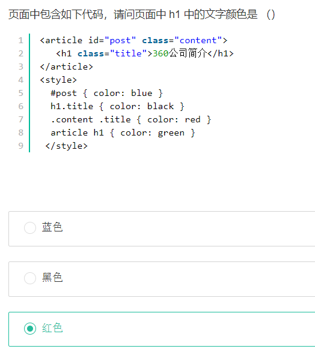

注意一点：**继承的样式优先级为0！！！#post父级的样式！！**

**CSS有哪些属性是可以继承的?**

* 字体：font-fanily font-weight font-size font-style
* 文本：text-indent text-align line-height word-spacing letter-spacing text-transform color 
* 元素可见性:visibility
* 列表布局属性:list-style
* 光标属性：cursor

**换行与省略**

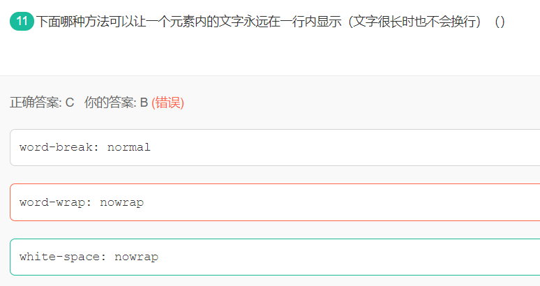

* work-break:normal | break-all | keep-all /* 浏览器默认 | 允许在单词内换行 | 只在半角空格或连字符处换行*/*

* *work-wrap:normal | break-word /* 默认换行规则 | 允许在长单词内换行*/*

* ***white-space:**normal | **nowrap** /*默认规则 | **长文本不换行，直至遇见` `*/**

  word-spacing:normal | length(30px) | inherit  /*默认字符间距 | 设定段落字符间距（可负值）| 继承父辈的值*/

* overflow : hidden;/* 内容超出宽度时隐藏超出部分的内容 */

* text-overflow : ellipsis;/* 溢出时显示省略标记...；需与overflow:hidden;一起使用*/

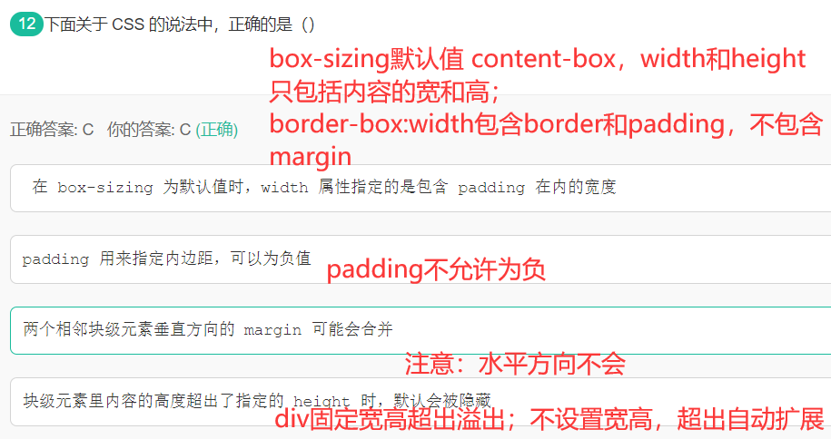

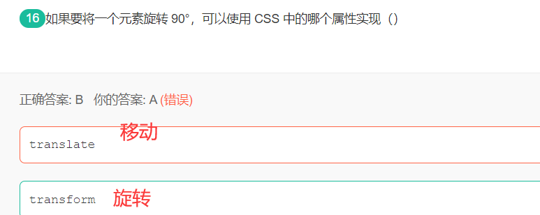

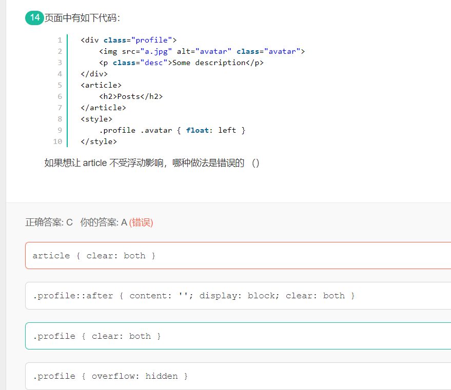

# js

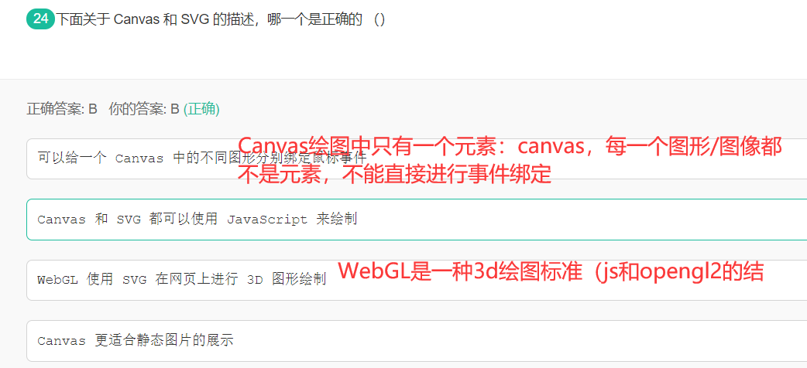

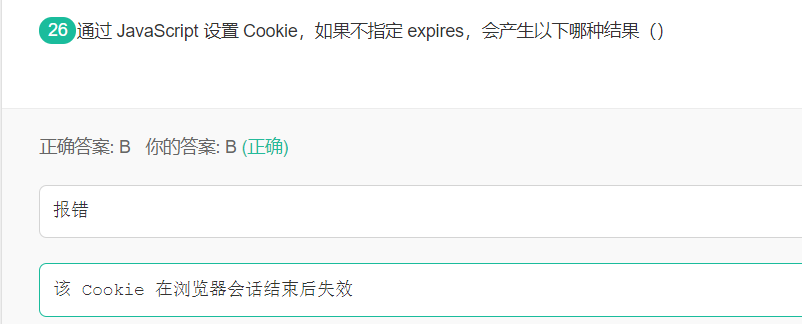

如果不定义cookie的过期时间，那么cookie的过期时间就是会话期间，也就是说，此时的cookie和sesstion是等效的，唯一不同的是cookie存储在客户端的内存中，session存储在服务器的内存中

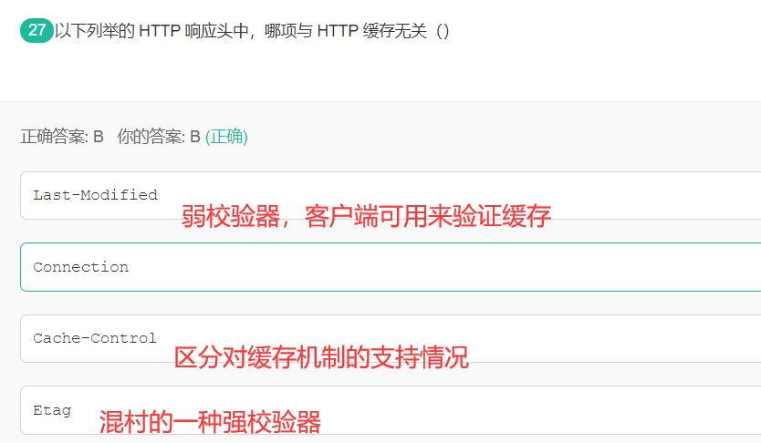

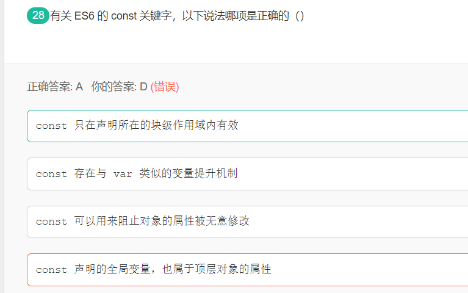

const没有变量提升机制，但是会形成暂时性死区，也即在const声明之前使用声明变量会报错。

const实质只是规定声明变量的内容不被改变，对于引用类型的对象，变量存的是指针，只要不改动指针，改对象的属性是可以的。

var声明全局变量会注册到window对象上，但是let和const不会

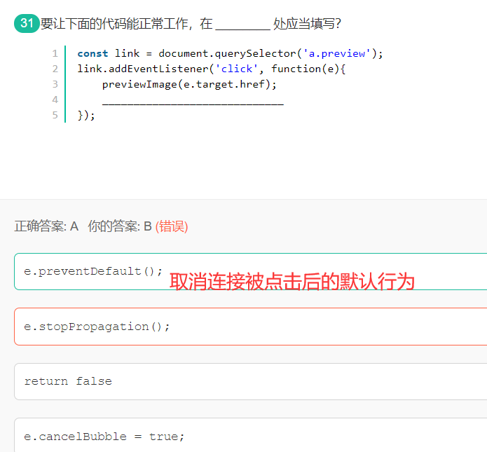

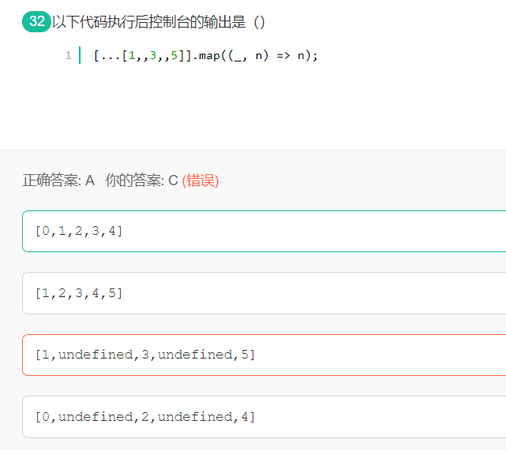

第一个值是item，第二个值是索引

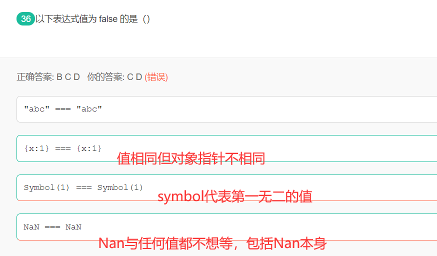