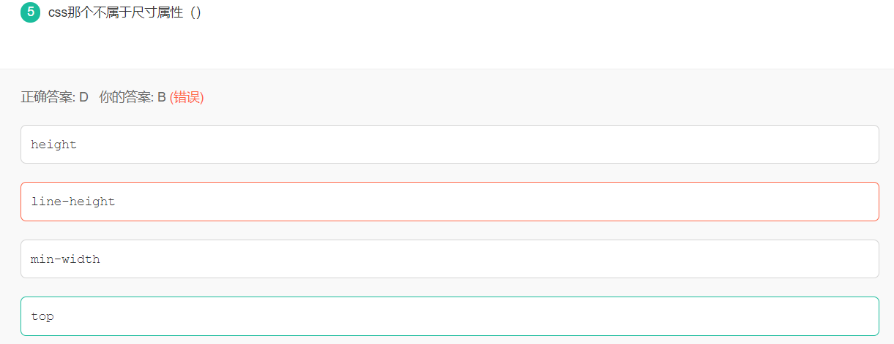

# 20-GREE


# 选择题

## CSS尺寸属性



top是距离，而非尺寸

## ES6声明变量


A.使用const声明的变量必须同时初始化为某个值。一经声明，在其生命周期的任何时候都不能再重新赋予新值。

```js
const a; //  SyntaxError: Missing initializer in const 
```

B.**let的一个特性是禁止在同一个作用域下重复声明。**所以B选项排除

D.块级作用域由最近的一对包含花括号{}界定。换句话说，if块、while块、function块，甚至连单独的块也是let声明变量的作用域。D会报错 a is notdefined

## 正则表达式


**^**是正则表达式匹配**字符串开始**位置

$是正则表达式匹配**字符串结束**位置

## ES6解构表达式


此处 a = 1 相当于给了a 一个默认值 1，而 b 的默认值就是undefine


这个属于字符串的变量解析，具体可以看阮一峰老师的ES6教程，字符串会被转化成一个类数组的对象，因此每一个字符都会和左边一一对应

符串也可以解构赋值。这是因为此时，字符串被转换成了一个类似数组的对象。

```js
const [a, b, c, d, e] = 'hello'; a // "h" b // "e" c // "l" d // "l" e // "o" 
```

类似数组的对象都有一个length属性，因此还可以对这个属性解构赋值。

```js
let {length : len} = 'hello'; len // 5
```

## ES6箭头函数


* 箭头函数是没有argument关键字的，argument关键字是一个数组储存着所有传入其中的形参
* D选项箭头函数若函数体只有1条表达式会被默认返回；
* 箭头函数是没有自己的this，有的话就是指向它的上一级即它的父级元素

# 填空题

## Http请求返回码


答案：401

| 代码 | 错误信息     |                                            |
| ---- | ------------ | ------------------------------------------ |
| 400  | 错误请求     | 服务器不理解请求的语法                     |
| 401  | 身份验证错误 | 此页要求授权，您可以不希望将此网页纳入索引 |
| 403  | 禁止         | 服务器拒绝请求                             |
| 404  | 未找到       | 例如：对于服务器上不存在的网页会返回此代码 |

## window.onload


```js
window.onload =function(){}
```

## JS面向对象


## CSS3过渡


# 问答题

## script放在head和放到body底部的区别

16 描述一下脚本`<script>`放在`<head>`和放到`<body>`底部的区别

**可以把HTML看成时从上往下加载的**

* script未设置async时
  1. script放在head内，会组设HTML代码的解析和渲染，放在body底部，不会阻塞
  2. script放在head，脚本访问不到body中的元素，将无法操作HTML元素
  3. script放在head，无法通过脚本改变内联的CSS样式，放在body底部，可以。
* script设置async时
  * 放在head还是body底部没区别
* script设置defer时（仅对IE有用），script脚本会异步加载，在加载过程中不会组设HTML代码的渲染和解析，当script脚本加载完毕后，会立即执行，此时会阻塞HTML代码的解析和渲染

## Promise封装Ajax


```js
return new Promise(function(resolve,reject){
  var req = new XMLHttpRequest();
  req.open("POST","http://www.baidu.com",true);
  req.onload = function(){
    if(req.readyState === 4 && req.status == 200){
      resolve(req.response);
    }else{
      reject(req.statusText)
    }
  }
  req.onerror = function(){
    reject(Error("网络异常"))
  }
});
```

