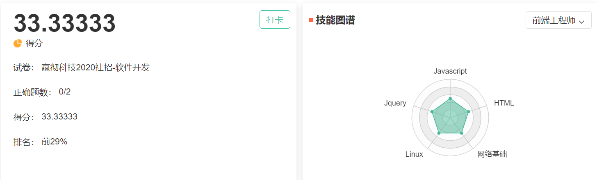
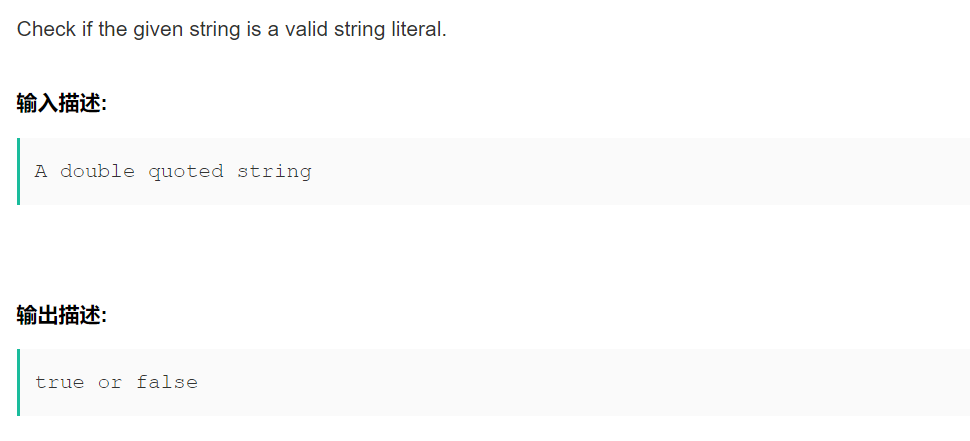
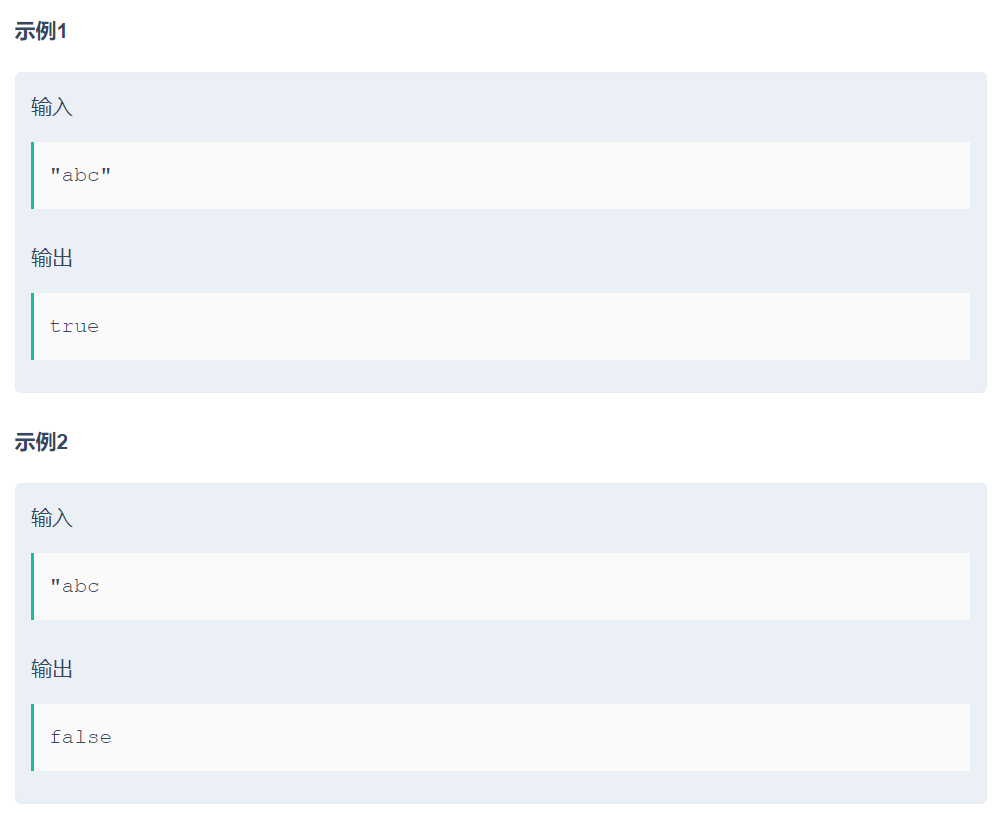
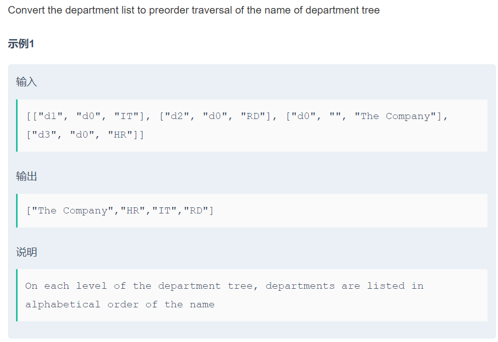

# 20-Inceptio



# 编程题

## 1.String literal validation





分析思路

1. 第一和最后个字符必须是双引号，需要注意的是输入单个字符

2. 中间的字符不能有双引号

3. 对于输入值是转义符的影响。 我的解决方法：

   1、先排除长度小于2的，判断前后字符是否是双引号

    2、循环来排除双引号 

   3、将转义符和转义符后一位的字符替换。

```java
import java.util.*;

public class Main{
    //处理转义字符
    public char[] removeChange(char[] t){
        for(int i=1;i<t.length-1;i++){
            if(t[i]=='\\'){
                t[i]=' ';
                t[i+1]=' ';
                i+=2;
            }
        }
        return t;
    }

    public static void main(String[] args) {
        Main main = new Main();
        Scanner scanner = new Scanner(System.in);
        String input = scanner.nextLine();
        char[] c = input.toCharArray();
        char[] t = main.removeChange(c);

        //空字符串
        if(input.length()<2){
            System.out.println("false");return;
        }
        //两头都是“的形如”1231“的才是字符串
        if(t[0]!='"'||t[t.length-1]!='"'){
            System.out.println("false");return;
        }
        //中间不能有"
        for(int i=1;i<t.length-1;i++){
            if(t[i]=='"'){
                System.out.println("false");return;
            }
        }
        System.out.println("true");
    }
}
```

## 2.Convert the department list to preorder traversal of the name of department tree



思路

列表的格式：[["id1", "parentId", "name"]...] 

意思是 这个节点的id, 父节点id，节点名称，root的parentid为空。

1. 建立一个id-name转换表，并且找到根节点

2. 找到每个节点的父节点 （在父节点中插入该节点）

3. 先序遍历

```java
import java.util.*;

/**
 * 规律：先序遍历 但是每一层要按照字典序进行
 */
public class Solution {
    /**
     * Convert the department list to preorder traversal of the department tree
     * @param departments string字符串二维数组 [["id1", "parentId", "name"]...], there's only one root department with empty parent id.
     * @return string字符串一维数组
     */
    /**
     * 节点结构
     */
    class Node {
        String id;
        List<Node> sons;
        String name;

        Node(String id, String name) {
            this.id = id;
            this.sons = new ArrayList<>();
            this.name = name;
        }
    }

    List<String> res = new ArrayList<>();

    public String[] listToTree(String[][] departments) {

        System.out.println("z".compareTo("def"));

        //排序 每一层按照字典序进行
        for (int i = 0; i < departments.length; i++) {
            for (int j = i + 1; j < departments.length; j++) {
                if (departments[i][2].compareTo(departments[j][2]) > 0) {
                    String[] temp = departments[i];
                    departments[i] = departments[j];
                    departments[j] = temp;
                }
            }
        }


        //记录父节点
        Deque<String> parents = new ArrayDeque<>();

        //hashMap id Node
        HashMap<String, Node> hashMap = new HashMap<>();
        //超级节点
        hashMap.put("", new Node("", ""));
        //添加节点
        for (int i = 0; i < departments.length; i++) {
            //添加一个节点
            Node n = new Node(departments[i][0], departments[i][2]);
            hashMap.put(departments[i][0], n);
        }
        //添加儿子节点
        for (int i = 0; i < departments.length; i++) {
            //添加一个节点
            hashMap.get(departments[i][1]).sons.add(hashMap.get(departments[i][0]));
        }

        //先序
        preOrder(hashMap, hashMap.get("").sons.get(0).id);

        String[] result = new String[departments.length];

        for (int i = 0; i < res.size(); i++) {
            result[i] = res.get(i);
        }

        return result;
    }

    /**
     * 先序遍历
     *
     * @param hashMap
     * @param curNodeId
     */
    public void preOrder(HashMap<String, Node> hashMap, String curNodeId) {

        res.add(hashMap.get(curNodeId).name);
        if (hashMap.get(curNodeId).sons.size() == 0) {
            return;
        }
        for (Node n : hashMap.get(curNodeId).sons) {
            preOrder(hashMap, n.id);
        }

    }
}
```

