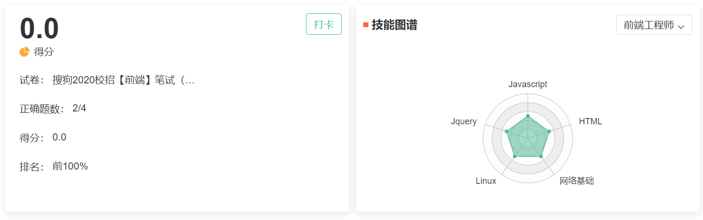
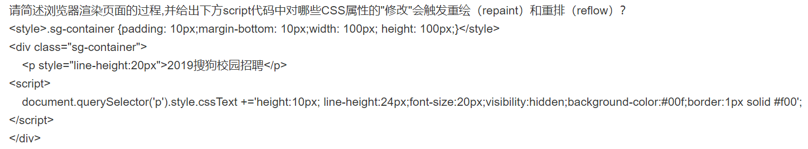
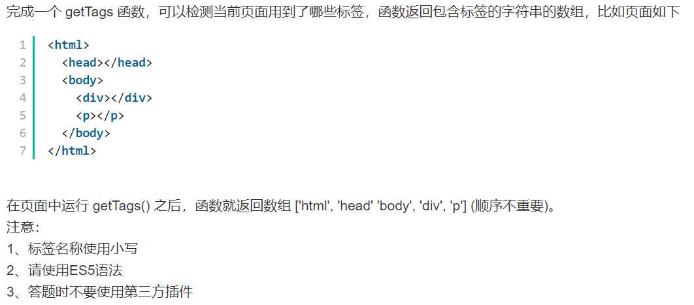
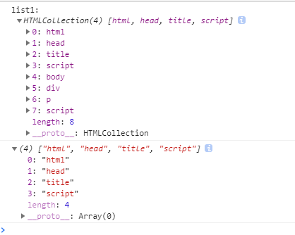
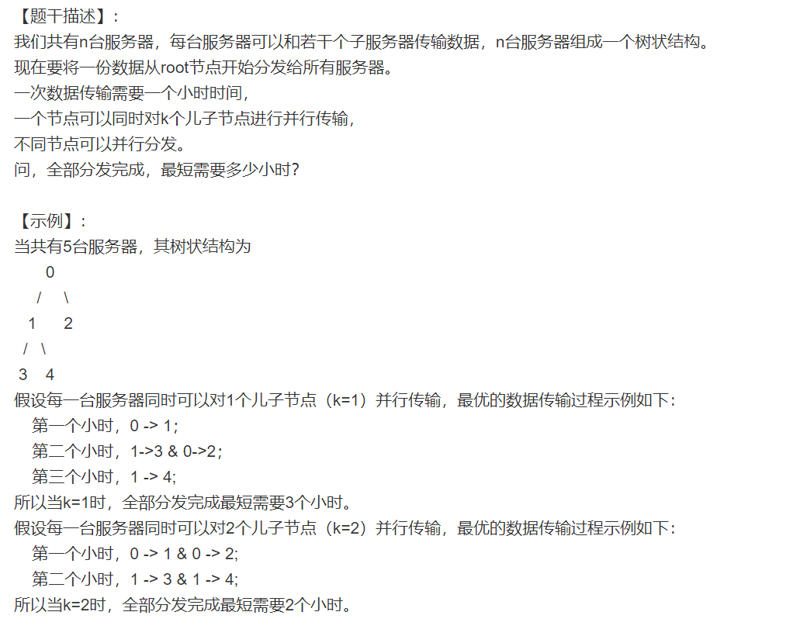
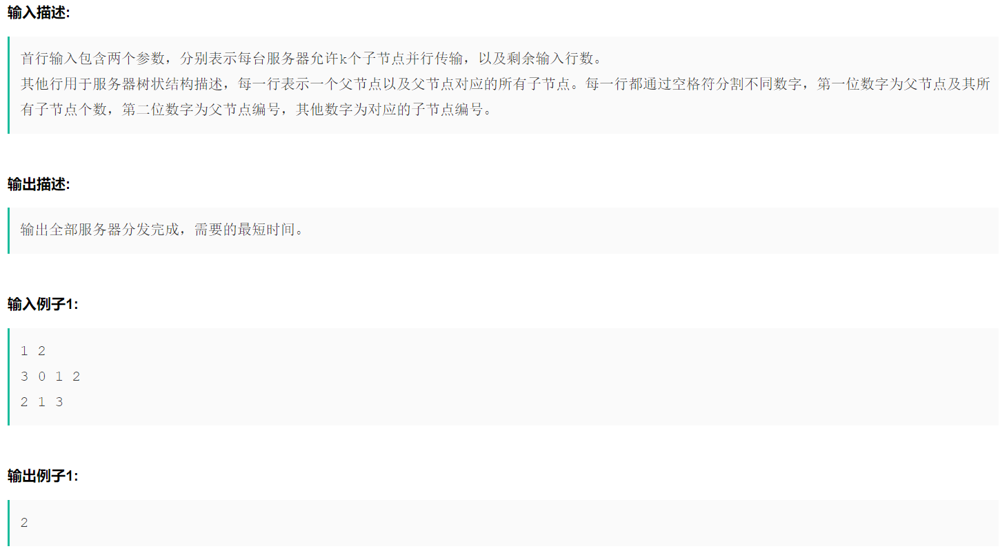

# 20 - Sogou 第一场



# 问答题

## 1. XMLHttpRequest & JSONP

**请简述XMLHttpRequest、JSONP的适用场景，并针对两种请求形式简述如何检测请求错误**、

### 参考答案

1. **使用场景：**
   * XMLHttpRequest用于**浏览器端与服务器端异步请求数据从而实现对页面的无刷新修改**，支持**GET/POST**请求，一般用于**非跨域**的场景。如果需要使用XMLHttpRequest跨域请求数据，需要通过**CORS**头支持**。
   * JSONP用于**跨域请求**数据的场景，只支持**GET**请求。
2. **如何检测请求错误：**
   * **XMLHttpRequest异常判断**一般通过该对象的**readystate和http状态码status**来判断
   * **JSONP的异常判断**一般是**onerror**事件和超时**timer**来判断。

### 补充

**XMLHttpRequest**

* XMLHttpRequest是一个API内置对象。

* XMLHttpRequest 用于在后台与服务器交换数据。这意味着可以在不重新加载整个网页的情况下，对网页的某部分进行更新。

* XMLHttpRequest 是 AJAX 的基础。

* **错误检测**是通过该对象的readystate和status来判断

  * **readyState**表示当前XMLHttpRequest对象处于什么状态，

    | readyState | 状态     |                                        |
    | ---------- | -------- | -------------------------------------- |
    | 0          | 初始化   | XMLHttpRequest对象还没有完成初始化     |
    | 1          | 载入     | XMLHttpRequest对象开始发送请求         |
    | 2          | 载入完成 | XMLHttpRequest对象的请求发送完成       |
    | 3          | 解析     | XMLHttpRequest对象开始读取服务器的响应 |
    | 4          | 完成     | XMLHttpRequest对象读取服务器响应结束   |

  * **status**能获取服务端的http响应状态码，当readystate===4时根据status时状态码可以判断http请求错误

**JSONP**

* jsonp的核心原理就是目标页面回调本地页面的方法，并带入参数
* 由于浏览器的安全限制，数据不可以直接跨域，需要通过在授权的数据返回里设置jsonp来让该接口允许所有的调用者获取数据。
* jsonp可以将目标代码作为js的形式加载过来
  还可以直接利用jquery的ajax请求jsonp
* **JSONP**是一种**解决跨域的方式**，原理应用< script >< img>< iframe>这些标签不受同源限制
* JSONP的**异常判断**一般是onerror事件和超时timer来判断

**跨域请求**

跨域请求：当前发起请求的域与该请求指向的资源所在的**域**不同时的请求。

这里的域指的是这样的一个概念：我们认为如果 “协议 + 域名 + 端口号” 均相同，那么就是同域。

## 2.简述浏览器渲染页面的过程



览器渲染过程因不同内核可能会有差异，现以webkit为例描述浏览器渲染原理，浏览器渲染过程主要分为三个阶段，先详述如下：

**第一阶段**

1. 用户输入URL时，webkit依赖网络模块加载网页或资源数据
2. 网页被交给HTML解释器转变成一系列的词语
3. 解释器根据词语构建节点并形成**DOM树**
4. 如果节点是CSS、图片、视频等资源，会调用资源加载器加载他们，因该类资源加载是异步的，不会阻塞当前DOM树的继续创建
5. 如果节点是javascript，停止当前DOM树的创建，直到javascript资源加载完成并被javascript引擎执行后才继续进行DOM的创建

**第二阶段**

1. CSS解释器解析CSS文件成内部表示结构，并在DOM树上附加样式信息形成**RenderObject树**
2. **RenderObject**节点在创建的同时，webkit会根据网页的层次结构创建**RenderLaye**r树，同时创建一个虚拟的绘图上下文

**第三阶段**

1. 根据生成的绘图上下文和2D或3D图形库生成最终的图像
2. 对于包含动画和用户交互的动态网页，浏览器的渲染过程会重复的执行，可能会触发不同程度的重排和重绘。

**重排属性**：height、line-height、font-size、border
**重绘属性**：height、line-height、font-size 、border、background-color、visibility

# 编程题

## 1.检测页面标签



html测试结构

```html
<!DOCTYPE html>
<html lang=zh-CHS>
<html>
<head>
  <title>2019搜狗校招编程题</title>
  <script type="text/javascript" src="index.js"></script>
</head>

<body>
  <div>
    <p>测试结构</p>
  </div>
</body>

</html>
```

js

```js
var getTags = function(){
  var list1 = document.getElementsByTagName("*");//ES5语法 返回HTMLCollection
  var list2 = document.querySelectorAll("*");//ES6语法，返回nodeList
  console.log("list1:\n",list1);
  // console.log("list2:\n",list2);

  var tags = Array.prototype.slice.call(list1);
  // console.log("tags:\n",tags);
  console.log(tags.map(function(item){
    return item.tagName.toLowerCase();
  }));
}
getTags();
```



## 2. 服务器数据分发（不会）






