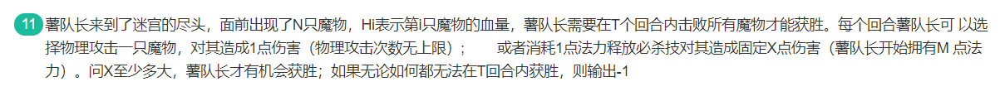

# 20-小红书

# 卷一


# 多选题

## 1. 阻塞DOM解析


* CSS加载
  * css加载不会阻塞DOM树的解析
  * css加载会阻塞DOM树的渲染
  * css加载会阻塞后面js语句的执行
* iframe
  * iframe会阻塞主页面的onload事件
* `<audio>`中的资源下载不会阻塞页面解析
* **MDN解析**：**当初始HTML文档已完全加载和解析时，将触发DOMContentLoaded事件**，而不需要等待样式表，图像和子框架页面加载（事件可以用来检测HTML页面是否完全加载完毕(fully-loaded)）

补充：

**会阻塞dom解析的资源有？**

详情见：https://blog.csdn.net/liuanpingfirst/article/details/85276720

1. 内联css
2. 内联js
3. 普通外联js
4. 外联 defer js
5. js之前的外联css

## 2. 跨域


* cookie中设置了httponly后js脚本将无法获取cookie信息，这样可以防范xss攻击
* **JSONP**
  * **一种无需考虑跨域问题即可传送 JSON 数据的方法。**
  * **不使用 XMLHttpRequest 对象。**
  *  **使用 `<script> `标签取而代之。**
* 同源策略是浏览器的安全策略
* localStorage API 不支持设置过期时间
  * 浏览器端需要存储一个用户的标识和`cookie`一样需要过期时间，但是用的是`localStorage`存储。而`localStorage`一经存储除非手动删除是不会过期的。

## 3. 浏览器js脚本下载和执行


* `window.requestAnimationFrame()`
  * 告诉浏览器希望执行动画并请求浏览器在下一次重绘之前调用指定的函数来更新动画
  * 该方法使用一个回调函数作为参数，这个回调函数会在浏览器重绘之前调用。
* addEventListener
  * `e.stopPropagation()`，阻止事件冒泡
  * `e.preventDefault()` 取消事件的默认动作
* `<script>`
  * `async`
    1. 标记为async的脚本不保证按照它们的先后顺序执行
    2. 指定 async 属性的目的是表示**当前脚本不必等待其他脚本，也不必阻塞文档呈现。**
  * `defer`
    1. 表示脚本在执行时不会影响页面的构造，也就是说，脚本会被延迟到整个页面都解析完毕后运行
    2. 设置defer，告诉浏览器**立即下载，但是延迟执行**
    3. 延迟脚本总是按照指定它们的顺序执行


# 问答题

## 1. 原型链与继承


答案：

```js
A.prototype
B.prototype
A
A.prototype
A.prototype
```


## 2. setTimeout


```js
2
3
5
4
1
```

```js
1. setTimeout是定时器，属于宏任务，会在本轮宏任务结束之后的下一轮宏任务出现，现在进入宏任务队列等待
2. Promise执行，打印 2
3. i为9999时，执行resolve,promise的状态变为resolve，然后执行下一行代码，打印 3
4. promise得状态为resolved,所以then语句进入微任务队列中，在宏任务结束之前执行
5. 打印 5
6. 此时最后一行代码执行完毕，执行微任务，打印 4
7. 进入下一轮宏任务，打印 1
```

# 编程题

## 1. 数字使用 , 分割


我的思路：

分小数和整数处理。整数从头遍历（好像不对，应该是从尾部遍历)；小数按照小数点的位置向前向后遍历

对于符号单独处理。

```js
function paddingNum(num){
  num = num.toString();
  var numRes = "";
  var idx = num.indexOf(".");
  if(idx!=-1){
    //小数
    //左半部分
    var numLeft = "";
    for(let i=idx;i>=0;i--){
      numLeft += num[i];
      if((idx-i)!=0 && (idx-i)%3==0 && i!=0){
        numLeft += ",";
      }
    }
    numLeft = numLeft.split("").reverse().join("");
    //右半部分
    var numRight = "";
    idx +=1;
    for(let k=idx;k<num.length;k++){
      numRight += num[k];
      if((k-idx)!=0 && (k-idx)%3==0 && k!= (num.length-1)){
        numRight+=","
      }
    }
    numRes = numLeft+numRight;
  }else{
    //整数
    for(var j=0;j<num.length;j++){
      if(j!=0 && j%3==0 && j!= (num.length-1)){
        numRes+=","
      }
      numRes += num[j];
    }
  }
  //处理负号
  if(numRes[0]=="-" && numRes[1]==","){
    numRes = "-"+numRes.substring(2);
  }
  console.log(numRes);
}

paddingNum(33);
paddingNum(1234.56);
paddingNum(123456789);
paddingNum(987654.321);
paddingNum(-987654.3);
```

参考代码:

根据小数点`.`将左右分开，左半部分三位一处理，小于三位不处理。右边不处理

```js
function paddingNum(inputNum){
  let flag = inputNum >=0 ? true:false;
  let numArr = Math.abs(inputNum).toString().split('.');
  let right = numArr[1]? '.'+numArr[1]:'';
  let left = numArr[0];
  let temp = "";
  //处理小数点左半部分
  while(left.length >3){
    temp = ","+left.slice(-3) + temp;
    left = left.slice(0,left.length-3);
  }
  return flag ? left+temp+right : '-'+left+temp+right;
}

console.log(paddingNum(33));
console.log(paddingNum(1234.56));
console.log(paddingNum(123456789));
console.log(paddingNum(987654.321));
console.log(paddingNum(-987654.3));
```

## 2. 收集单词并反转


```js
function reverseStr(str){
  var pattern = /[^\s]+/g;
  str = str.match(pattern);
  console.log(str);
  str = str.reverse();
  console.log(str);
  return str.join(' '); 
}

var res = reverseStr('the	sky	is												blue!');
console.log(res);
```

## 2. 筛选精选笔记


动态规划

## 4. 击败魔物



考察点：二分搜索、贪心
