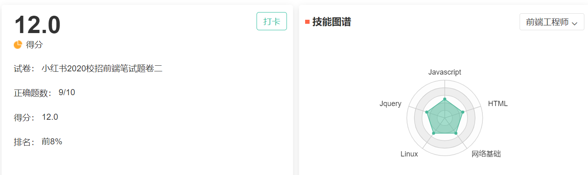
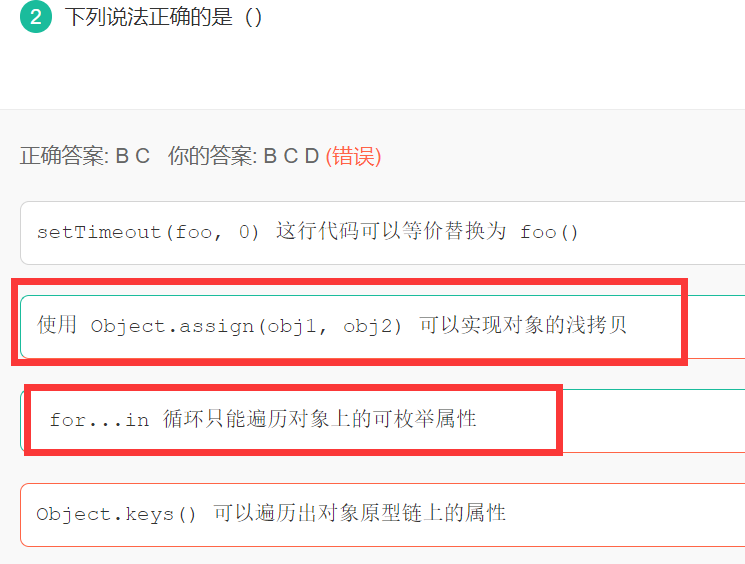
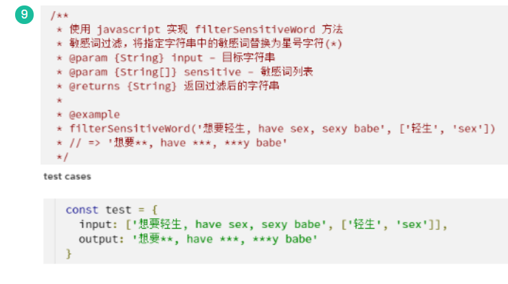
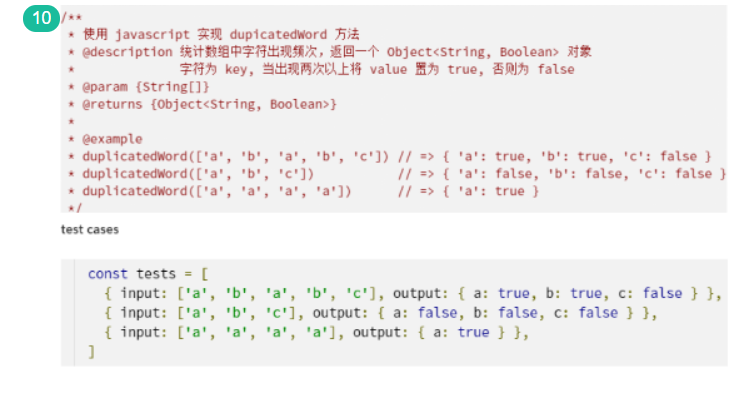
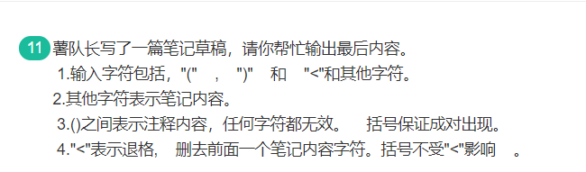
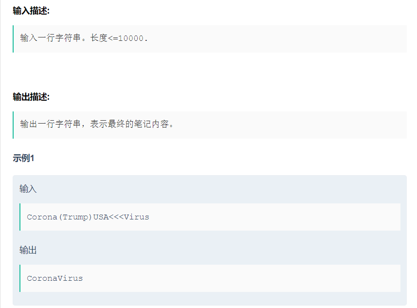
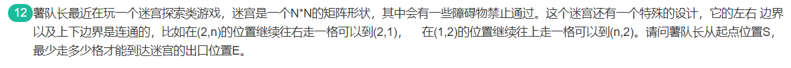

# 卷二



```js
function filterSensitiveWord(input){
  var sensitive = input[input.length-1];
  var output = input[0];
  for(var j=0;j<sensitive.length;j++){
    var pattern = new RegExp(sensitive[j],"g")
    output = output.replace(pattern,'*'.repeat(sensitive[j].length));
  }
  return output;
}

var input = ['想要轻生,have sex,sexy babe',['轻生','sex']];
console.log(filterSensitiveWord(input));
```

# 选择题

## 1. js基础



* **Object.keys方法**
  * 成员是参数对象自身的（不含继承的）所有可遍历（ enumerable ）属性的键名。
* for...in
  * 循环对象的所有枚举属性(包括原型上)，然后再使用hasOwnProperty()方法来忽略继承属性;

# 问答题

## 1. 严格模式

严格模式对Javascript的语法和行为，都做了一些改变。

参考：http://www.ruanyifeng.com/blog/2013/01/javascript_strict_mode.html?utm_source=tuicool&utm_medium=referral

* **全局变量显式声明**

* 静态绑定

  1. **禁止width语句：**因为with语句无法在编译时就确定，属性到底归属哪个对象。
  2. **创设eval作用域：**正常模式下，eval语句的作用域，取决于它处于全局作用域，还是处于函数作用域。严格模式下，eval语句本身就是一个作用域，不再能够生成全局变量了，它所生成的变量只能用于eval内部。

* 增强的安全措施

  1. **禁止this关键字指向全局对象**

  2. **禁止在函数内部遍历调用栈**

     ```js
     　　function f1(){
     　　　　"use strict";
     　　　　f1.caller; // 报错
     　　　　f1.arguments; // 报错
     　　}
     　　f1();
     ```

* **禁止删除变量**：严格模式下无法删除变量。只有configurable设置为true的对象属性，才能被删除。

* **显式报错**：

  1. 正常模式下，对一个对象的只读属性进行赋值，不会报错，只会默默地失败。严格模式下，将报错。

     ```js
     　　"use strict";
     　　var o = {};
     　　Object.defineProperty(o, "v", { value: 1, writable: false });
     　　o.v = 2; // 报错
     ```

  2. 严格模式下，对一个使用getter方法读取的属性进行赋值，会报错。

     ```js
     "use strict";
     　　var o = {
     　　　　get v() { return 1; }
     　　};
     　　o.v = 2; // 报错
     ```

  3. 严格模式下，对禁止扩展的对象添加新属性，会报错。

     ```js
     　"use strict";
     　　var o = {};
     　　Object.preventExtensions(o);
     　　o.v = 1; // 报错
     ```

  4. 严格模式下，删除一个不可删除的属性，会报错。

     ```js
     　"use strict";
     　　delete Object.prototype; // 报错
     ```

* 重名错误

  1. **对象不能有重名的属性**
  2. **函数不能有重名的参数**
  3. **禁止八进制表示法**

* arguments对象的限制

  1. **不允许对arguments赋值**
  2. **arguments不再追踪参数的变化**
  3. **禁止使用arguments.callee**

* **函数必须声明在顶层**

* 保留字：严格模式新增了一些保留字：implements, interface, let, package, private, protected, public, static, yield。

## 2. typeOf

```js
console.log(typeof NaN);//number
console.log(typeof Function);//function
console.log(typeof Object);//function
console.log(typeof {});//object
console.log('a'+1);//a1
console.log('a'-1);//NaN
console.log(Function instanceof Object)//true
console.log(Object instanceof Function);//true
```

JS-数据类型- typeof/instanceof/Object.prototype.toString

https://juejin.im/post/6844903728739254286

# 编程题

## 1. 字符替换

思路：使用正则表达式



```js
function filterSensitiveWord(input){
  var sensitive = input[input.length-1];
  var output = input[0];
  for(var j=0;j<sensitive.length;j++){
    //var pattern = new RegExp(sensitive[j],"g");
    var pattern = new RegExp(`${sensitive[j]}`,"g");
    output = output.replace(pattern,'*'.repeat(sensitive[j].length));
  }
  return output;
}

var input = ['想要轻生,have sex,sexy babe',['轻生','sex']];
console.log(filterSensitiveWord(input));
```

## 2.记录词频



判断对象有没有属性用 **hasOwnProperty()**

```js
function duplicateWord(input){
  //记录字符出现字数
  var duplicate = {};
  for(var i=0;i<input.length;i++){
    if(duplicate.hasOwnProperty(input[i])){
      duplicate[input[i]] = true;
    }else{
      duplicate[input[i]]= false;
    }
  }
  return duplicate
}

var input = ['a','b','a','b','c'];
// var input = ['a','b','c'];
// var input = ['a','a','a','b'];
console.log(duplicateWord(input));

```

## 3. 笔记草稿提取内容





```js
function extractContent(str){
  //将字符串变为数组
  var stack = [];
  str = str.split("");
  //利用栈提取()里的内容
  var res = "";
  for(var i=0;i<str.length;i++){
    if(str[i]!="(" && str[i]!=")" && stack.length == 0){
      res += str[i];
    }
    if(str[i]=="("){
      stack.push(i);
    }
    if(str[i]==")"){
      stack.pop();
    }
  }
  //处理 <
  var output = [];
  output = res.split("");
  for(var i=0;i<output.length;i++){
    if(output[i]=="<"){
      output.splice(i-1,2);
      i--;
      i--;
    }
  }
  //处理 ，
  console.log(output.toString().replace(/\,/g,""););
}


// var input = "Corona(Trump)USA<<<Virus";
var input = "a(12345678909987654321234567890987654321)bkdasgtj<ufighs<jhgyu<<<<<<<<<";

```

## 4. 迷宫探索

