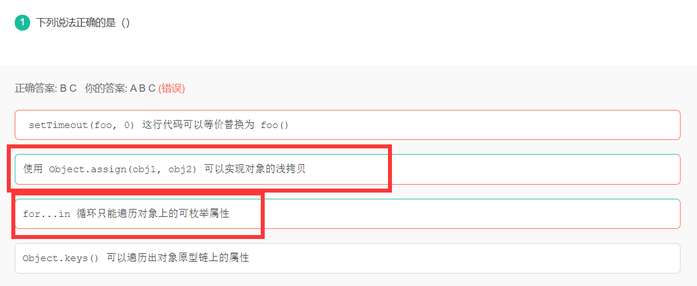
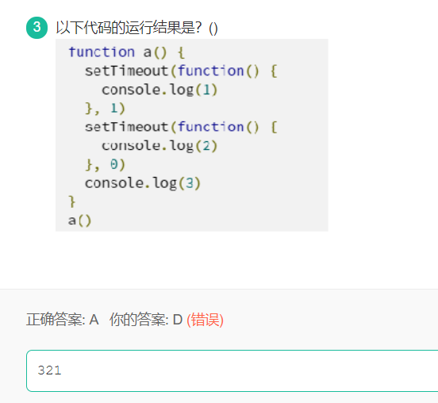

# 20 - 小红书 -3 


# 选择题

## 1.



* `for in`循环是遍历对象上的每一个可枚举属性,包括原型链上面的可枚举属性,
* `obeject.keys()`只是遍历自身的可枚举属性,不可以遍历原型链上的可枚举属性,
* `object.assign()`对象的拷贝,用于将所有可枚举属性的值从一个或多个源对象复制到目标对象,将他返回到目标对象

## 2. setTimeout

```js
function a(){
  setTimeout(function(){
    console.log(1);
  },1);
  setTimeout(function(){
    console.log(2);
  },0);
  console.log(3);
}
a();
```



# 解答题

1. 运行结果

```js
var name = 'Jay';

function Person(name){
  this.name = name;
  console.log(this.name);
}

var a = Person('Tom');//tom
console.log(name);//jay
console.log(a);//undefined

var b = new Person('Michael');//Michael
console.log(b);//Person {name:'Michael'}
```