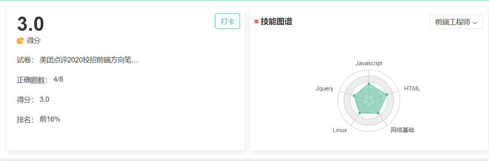
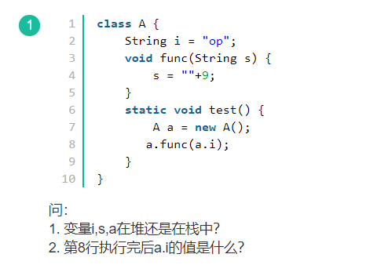
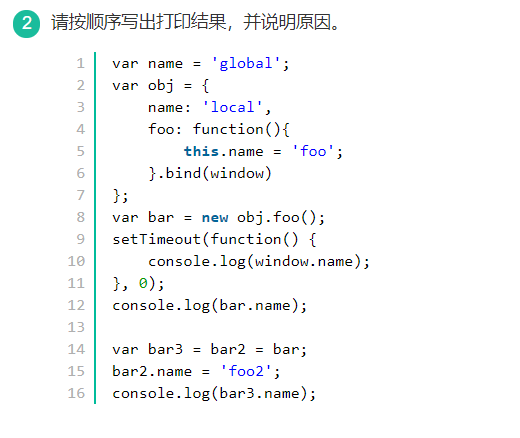
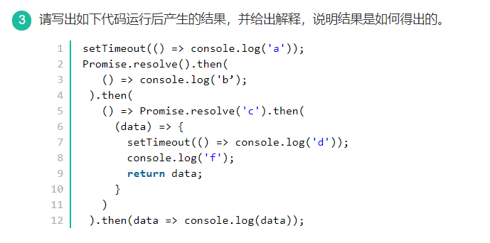
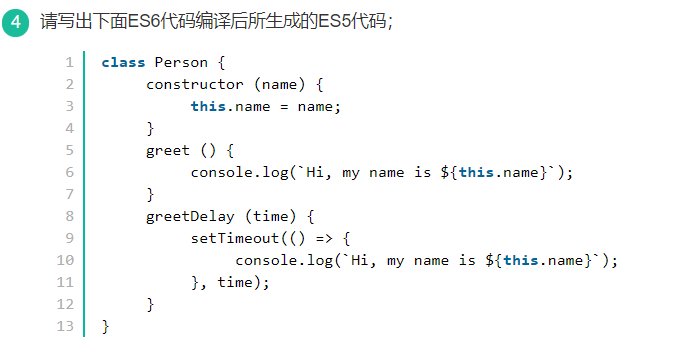
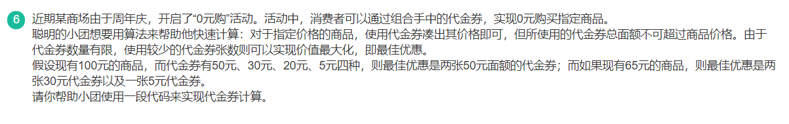
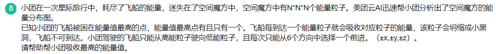

# 20 - 美团点评



# 解答题

## 1. 堆/栈内存，参数传递



**答案：**

1. i，s，a都在栈中，new出来的对象A在堆上
2. op

**补充知识**

1. JavaScript堆和栈
   * **栈**内存用于**存储各种基本类型的变量**，包括Boolean,Number,String,Undefined,Null以及对象变量的指针，**堆**主要存储**object**
   * 所以字符串变量i,s以及对象指针a都存在栈中，new出来的对象开辟内存存在堆上，对应地址是指针a存的内容
2. 考察参数传递按值传递：
   * a是A类的实例，所以a.i='op'，a.func(a.i)这句执行函数，把a.i作为参数传递，该函数会复制一个变量，两个变量完全独立，所以在函数体里只是把复制的那个变量（一个新的局部变量）改变为'op9’,在函数体外的a.i并没有被改变
   * 另外补充说明**ECMAScript中所有函数的参数都是按值传递的**，——《高程3》，其实对于参数是对象的情况，实际上也是按值传递，把传参的指针复制出一个完全独立的变量，只是存的内容和传参对象地址一摸一样

## 2. Event Loop / this指针 / 引用类型赋值



答案：foo, foo2, global

解析：考察点3个： 

1. 输出顺序主要考察：Event Loop；
2. 第一个和第三个输出考察：this指针；
3. 第二个输出考察：引用类型赋值

```js
//考察this指针
var name = "global";
var obj = {
  name:'local',
  foo:function(){
    this.name = 'foo';
  }.bind(window)
};

var bar = new obj.foo();
//先obj.foo() 然后new他执行后的结果
//这里应该是 new(obj.foo())
//由于new绑定的优先级大于bind绑定，所以函数内部this还是obj{}
// console.log(bar);//{name：'foo'}
// console.log(window.name);//global

//定时器任务，在最后放入任务对象，window对象没有被改变，所以输出global
//setTimeout设置一个定时器，定时器到时后调用回调函数，但定时器到时后只能将回调的执行放到事件队列的末尾，不能插队，所以console.log(window.name)这条输出语句是最后执行的
setTimeout(function() {
  console.log(window.name);//global
}, 0);

console.log(bar.name);//foo,此时bar.name =foo,因为被赋值了

//此时执行顺序是var bar3,bar2=bar,bar3=bar2, 所以bar3/bar2/bar都是指向同一个对象
//注意：复杂类型值的复制是引用复制
var bar3 = bar2 = bar;
bar2.name = 'foo2';
// 所以bar2修改属性，bar3的也改变了，此时输出为'foo2'
console.log(bar3.name);//foo2


```

Event Loop https://segmentfault.com/a/1190000016278115

## 3.  event loop以及宏任务和微任务



答案：bfcad

```js
// 定时器任务属于宏任务，并且需要先在任务队列等待，等到同步任务执行完，执行栈清空，才会在任务队列中按顺序选任务进去
setTimeout(() => console.log('a'));//4. 打印a

//Promise 属于异步微任务，在本轮同步任务结束之前执行
Promise.resolve().then(
	// 1. 打印 b
   () => console.log('b')  // 单引号要改为',然后去掉;号
 ).then(
	// 箭头函数的resolve传递的参数作为下一个then的参数
   () => Promise.resolve('c').then(
	 // 执行箭头函数
     (data) => {
		// 把定时器任务也放入任务队列中等待，在第一个定时器之后
       setTimeout(() => console.log('d')); //5. 打印d
	   // 2.打印 f
       console.log('f');
	   // 此时返回的 数据作为下一个then的参数
       return data;
     }
   )
 ).then(data => console.log(data)); // 3.打印 c
 
* `打印bfcad`
```

## 4. ES6编译到ES5过程理解



```js
function Person(name) {
  this.name = name
  Person.prototype.greet = function () {
      console.log("Hi, my name is " + this.name);
  }
  Person.prototype.greetDelay = function (time) {
      var self = this
      setTimeout(function () {
          console.log("Hi, my name is " + self.name);
      }, time);
  }
}
```

这里需要注意：

setTimeout()调用的代码运行在与所在函数完全分离的执行环境上。这会导致这些代码中包含的 this 关键字会指向 window (或全局)对象

要让其指向函数内部，可以使用以下解决方法：

1. **使用局部变量**

   ```js
   var _this = this;
   setTimeout(function(){
       console.log("Hi, my name is "+_this.name);
   },time)
   ```

2. **使用箭头函数**

   ```js
   setTimeout(() => {
                  console.log("Hi, my name is "+_this.name);
    }, time);
   ```

3. **bind函数**

   ```js
   bind()方法是在Function.prototype上的一个方法，当被绑定函数执行时，bind方法可创建一个新函数，并将第一个参数作为新函数运行时的this
   ```


# 编程题

## 5. 斐波那契数列

```js
const readline = require('readline');
const rl = readline.createInterface({
    input: process.stdin,
    output: process.stdout
})

function Fibonacci(n,ac1=1,ac2=1){
  if(n<=1) {return ac2};
  return Fibonacci(n-1,ac2,ac1+ac2);
}

rl.on('line', n => {
    console.log(Fibonacci(n))
})
```

JavaScript写斐波那契数列的几种方式 https://blog.csdn.net/qq_39300332/article/details/80000837

## 6. 代金券计算



## 7. 迷宫

给定一个包含非负整数的 M x N 迷宫，请找出一条从左上角到右下角的路径，使得路径上的数字总和最小。每次只能向下或者向右移动一步。

## 8. 

