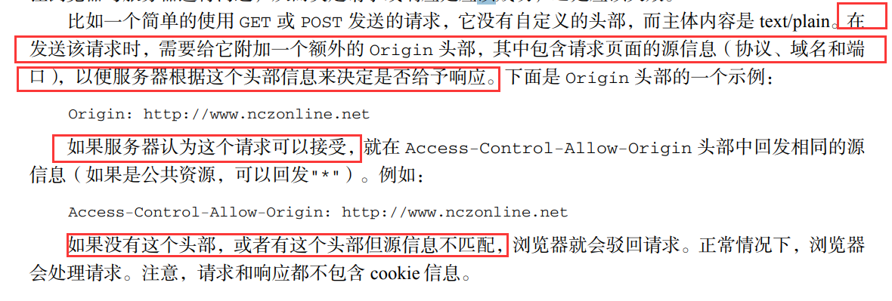

# 20-金山办公

# 1.事件循环机制


**题目：**以下代码的执行结果：

```js
new Promise((resolve) => {
  console.log('1')
  resolve()
  console.log('2')
}).then(() => {
  console.log('3')
})
setTimeout(() => {
  console.log('4')
})
console.log('5')
```

**答案**：1 2 5  3 4

# 2. 请列举几个HTML5语义化标签，并说说语义化有什么优点？

**语义化标签：** 

* `<title>`：页面主体内容。
* `<header>`：页眉通常包括网站标志、主导航、全站链接以及搜索框。
* `<nav>`：标记导航，仅对文档中重要的链接群使用。
* `<main>`：页面主要内容，一个页面只能使用一次。如果是web应用，则包围其主要功能。
* `<article>`：定义外部的内容，其中的内容独立于文档的其余部分。
* `<section>`：定义文档中的节（section、区段）。比如章节、页眉、页脚或文档中的其他部分。
* `<aside>`：定义其所处内容之外的内容。如侧栏、文章的一组链接、广告、友情链接、相关产品列表等。
* `<footer>`：页脚，只有当父级是body时，才是整个页面的页脚。
* `<cite>`：表示所包含的文本对某个参考文献的引用，比如书籍或者杂志的标题。
* `<dfn>`：定义术语元素，与定义必须紧挨着，可以在描述列表dl元素中使用。
* `<address>`：作者、相关人士或组织的联系信息（电子邮件地址、指向联系信息页的链接）。

**优点：**

1. **代码结构清晰**，方便阅读，有利于团队合作开发。语义化的标签相比较之前全都是div要清晰明了
2. **方便其他设备解析**（如屏幕阅读器、盲人阅读器、移动设备）以语义的方式来渲染网页。
3. **有利于搜索引擎优化（SEO）**。

# 3 列举几种除了px外的CSS度量单位

```js
1. rem 相对于根字体大小的单位，比如可以设置 1rem=50px
2. em 相对于font-size，比如font-size：16px（浏览器默认），则2em=32px
3. vm 即viewpoint width，视窗宽度，比如1vm的宽度为相对于视窗的宽度的百分之一
4. vh 即viewpoint height ，同上
```

# 4. new操作符做了什么

```js
function Person(name,age){
    this.name = name;
    this.age = age;
}

var person1 = new Person("sun",19);
```

要创建Person的新实例，必须使用new操作符，以这种方式调用构造函数会经历以下4个步骤

1. 创建一个新对象
2. 将构造函数的作用域赋给新对象（因此this就指向了这个对象）
3. 执行构造函数中的代码(为这个新对象添加属性)
4. 返回新对象

# 5. 简书cookie/session记住登录状态机制原理

**cookie**

* cookie是客户端的状态保存机制
* 存储在本地浏览器，且存储数据量有限，不同的浏览器有不同的存储大小，但一般不超过4KB。因此使用cookie只能存储一些小量的数据。
* 当浏览器访问网站后，这些网站将一组数据存放在客户端，当该用户发送**第二次请求**的时候，就会自动的**把上次请求存储的cookie数据自动携带给服务器，服务器通过浏览器携带的数据就能识别当前用户。**

**session**

* session是服务端的状态保存机制
* 存储在服务器，更安全，不被窃取
* Session是存放在服务器端的类似于HashTable结构（包括key，value）来存放用户数据，当浏览器第一次发送请求时，服务器自动生成了一个HashTable和一个Session ID用来唯一标识这个HashTable。并将其通过响应发送到浏览器。**当浏览器第二次发送请求**，会将**前一次服务器响应中的Session ID放在请求中一并发送到服务器上**，**服务器从请求中提取出Session ID，并和保存的所有Session ID进行对比，找到这个用户对应的HashTable。**


# 6. 网页中接收事件的顺序（事件流）有哪些？它们之间的区别是什么？

事件流描述的是从页面中接受事件的顺序。

两种事件流模型：

1. **冒泡型事件流**，从最特定的事件目标到最不特定的事件目标，从DOM树的叶子到根
2. **捕获型事件流：**从最不特定的事件目标到最特定的事件目标，根到叶子。

# 7. css属性position都有哪些值？

position的值的含义如下：

* **static：默认值**
  * 元素框正常生成。
  * 块级元素生成一个矩形框，作为文档流的一部分，行内元素则会创建一个或多个行框，置于其父元素中
* **relative：相对定位**
  * 元素框偏移某个距离，元素仍保持其未定位前的形状，它原本所占的空间仍保留
* **absolute：绝对定位**
  * 元素框从文档流完全删除，并相对于其包含块定位，包含块可能是文档中的另一个元素或者是初始包含块。
  * 元素原先在正常文档流中所占的空间会关闭，就好像该元素原来不存在一样。
  * 元素定位后生成一个块级框，而不论原来它在正常文档流中生成何种类型的框。
* **fixed：固定定位**
  * 元素框的表现类似于将position设置为abosolute，不过其包含块是视窗本身。

# 8.简述你对HTTP控制访问（CORS）的理解。

默认情况下，XHR对象只能访问与包含它的页面位于同一个域中的资源（备注：也就是同源限制：必须要相同的协议，域，端口才能访问）

**CROS定义了在必须访问跨域资源时，浏览器域服务器应该如何沟通。**

CROS背后的思想：使用自定义的HTTP头部让浏览器与服务器进行沟通，从而决定请求或响应是应该成功，还是应该失败。



