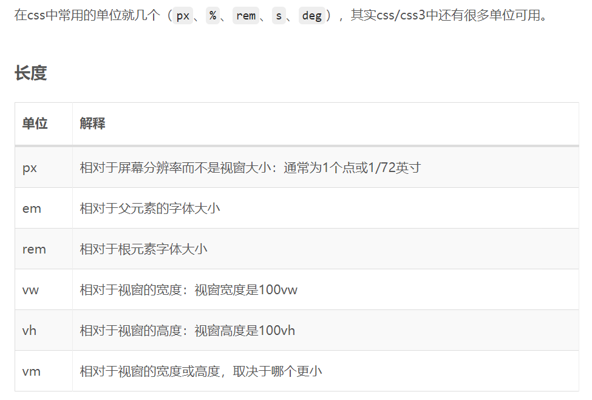
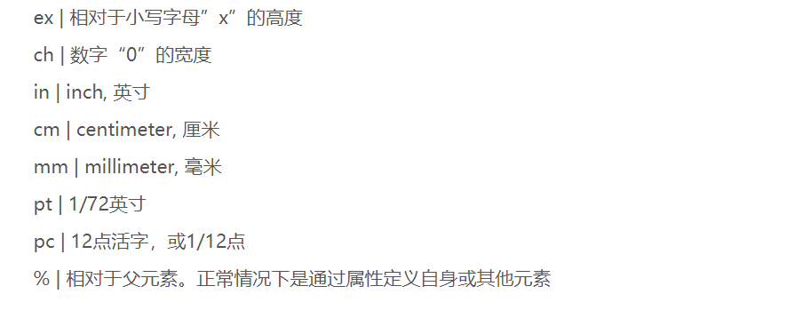
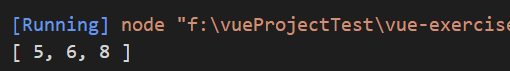
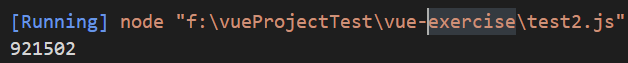

2020 海康威视前端工程师面试

记于2020-8-29

# 选择题

***

## 马匹问题

一共有*25*匹马，有一个赛场，赛场有*5*个赛道，就是说最多同时可以有*5*匹马一起比赛。假设每匹马都跑的很稳定，不用任何其他工具，只通过马与马之间的比赛，试问最少得比多少场才能知道跑得最快的*5*匹马？

7场
## h5新特性


https://juejin.im/post/6844903680756416520

加粗为题目中考到的

* **新增元素**：语义化更好的标签元素

  1. 结构元素：**article**、**aside、header**、hgroup、footer、figure、section、nav
  2. 其他元素：video、audio、canvas、embed、mark、progress、meter、time、command、details、datagrid、keygen、output、source、menu、ruby、wbr、bdi、dialog

* **废除的元素:** 纯表现元素、部分浏览器支持的元素和对可用性产生负面影响的元素

  1. 纯表现元素：basefont、big、center、font、s、strike、tt、u 用css代替
  2. 部分浏览器支持的元素：applet、bgsound、blink、marquee
  3. 对可用性产生负面影响的元素：frameset、frame、noframes,在html5中不支持frame框架，只支持iframe框架

* **新增的API**

  1. **Canvas**：首先获取canvas元素的上下文对象，然后使用该上下文对象中的绘图功能进行绘制。

  2. SVG：SVG是html5的另一项图形功能，是一种标准的矢量图形，是一种文件格式，有自己的API。

  3. 音频和视频：2大好处,一是作为浏览器原生支持的功能，新的audio和video元素无需安装；二是媒体元素向web页面提供了通用、集成和可脚本化控制的API。

  4. Geolocation：可以请求用户共享他们的位置。位置信息来源IP地址、三维坐标、GPS、从RFID、Wifi和蓝牙到Wifi的MAC地址、GSM或CDMA手机的ID、用户自定义数据

  5. Communication：跨文档消息通信，可以确保iframe、标签页、窗口间安全地进行跨源通信。

  6. `XMLHttpRequest Level2`：改进了跨源`XMLHttpRequest`和进度事件，`XMLHttpRequest Level2`通过CORS实现了跨源`XMLHttpRequest`。跨源HTTP请求包含一个Origin头部，它为服务器提供HTTP请求的源信息。

  7. `WebSockets`：要连接远程主机，只需新建一个`WebSocket`实例，提供希望连接的对端URL。

  8. Forms：新表单元素tel、email、url、search、range、number 未来的表单元素color、datetime、datetime-local、time、date、week、month

  9. 新表单特性和函数：placeholder、autocomplete、autofocus、spellcheck、list特性、datalist元素、min和max、step、required

  10. 拖放API：`draggable`属性、拖放事件(dragstart、drag、dragenter、dragleave、dragover、drap、dragend)、dataTransfer对象

  11. Web Workers API：Web Workers可以让Web应用程序具备后台处理能力，对多线程的支持性非常好。但是在Web Workers中执行的脚本不能访问该页面的window对象，也就是Web Workers不能直接访问Web页面和DOM API。虽然Web Workers不会导致浏览器UI停止响应，但是仍然会消耗CPU周期，导致系统反应速度变慢。

  12. Web Storage API：`sessionStorage`(保存在session中，浏览器关闭，数据消失)、**localStorage**(保存在客户端本地，除非手动删除，否则一直保存)

      


## 跨域
下列哪些功能默认支持跨域? ()

A. LocalStorage

B. Image

C. canvas

D. iframe

正确答案：B D


### CSS3 nth 伪类选择器

https://www.cnblogs.com/Wayou/p/css3-nth-selector.html

## JS中实现继承

https://www.jianshu.com/p/c6eaaf15035b

1. **原型链继承**
2. **借助构造函数继承**
3. **组合式继承（将原型链继承与构造函数结合起来**
4. 原型式继承
5. 经典继承（Es5中的新语法：存在兼容性问题，需要做浏览器的能力检测）
6. 寄生式继承（类似于原型式继承）
7. 寄生组合式继承（组合继承+寄生继承）

## JS中事件类型

UI (User Interface) 事件，当用户与页面上的元素交互时触发

Load事件：当页面完全加载后，就会触发window上的load事件。

Unload事件：在文档被完全卸载后触发。只要用户从一个页面切换到另一个页面，就会触发。

Resize事件：当浏览器调整到一个新的高度或宽度时，就会触发resize事件。注意不要在这个事件中加入计算逻辑，避免性能问题。

焦点事件，在页面获得或失去焦点时触发

鼠标与滚轮事件

## CSS中的单位

https://www.dazhuanlan.com/2020/04/01/5e848b6f4c484/





## v-model的修饰符和使用

v-model的修饰符

* v-model.lazy 只有在input输入框发生一个blur时才触发
* v-model.trim 将用户输入的前后的空格去掉
* v-model.number 将用户输入的字符串转换成number

# 编程问答题

***

## promise与setTimeout执行顺序

https://juejin.im/post/6844903655473152008

# 编程题

***

##  找出数组中的重复元素

set + filter



利用map找到重复出现的元素，利用set的key唯一的特性

```js
function duplicates(arr) {
  let map =  new Map();
  let res = new Set();;
  arr.forEach(item =>{
      if(!map.has(item)){
          map.set(item,0);
      }else{
        map[item] = 1;
        res.add(item)
      }
  });
  return [...res];
}

console.log(duplicates([1, 2, 4, 4, 3, 3, 1, 5, 3]));function duplicates(arr) {
  let map =  new Map();
  let res = new Set();;
  arr.forEach(item =>{
      if(!map.has(item)){
          map.set(item,0);
      }else{
        map[item] = 1;
        res.add(item)
      }
  });
  return [...res];
}
```


## 求合数的个数

对于给定的数值num，求出小于等于num范围内的合数的个数（考虑算法性能）

我的思路：求出素数个数，减去就等于合数的个数

列出素数的最有效方法：[埃拉托斯特尼筛法](https://en.wikipedia.org/wiki/Sieve_of_Eratosthenes)（sieve of Eratosthenes）

http://jimyuan.github.io/blog/2019/04/09/find-primes-with-js.html

```js
// 返回参数范围（<=limit）内的所有合数个数
function getPrime (limit) {

  //判断是不是素数的逻辑
  function isPrime (v) {
    let i = 2, len = Math.sqrt(v)
    for (; i <= len; i++) {
      if (v % i === 0) return false
    }
    return true
  }

  //1.筛选出limit范围内的素数
  let n = 1, numArr = []
  while(n++ < limit) numArr.push(n)
  numArr = numArr.filter(isPrime);
  //2.limit减去素数的个数就是合数的个数
  return Number(limit-numArr.length);
}

console.log(getPrime(1000000));

```


